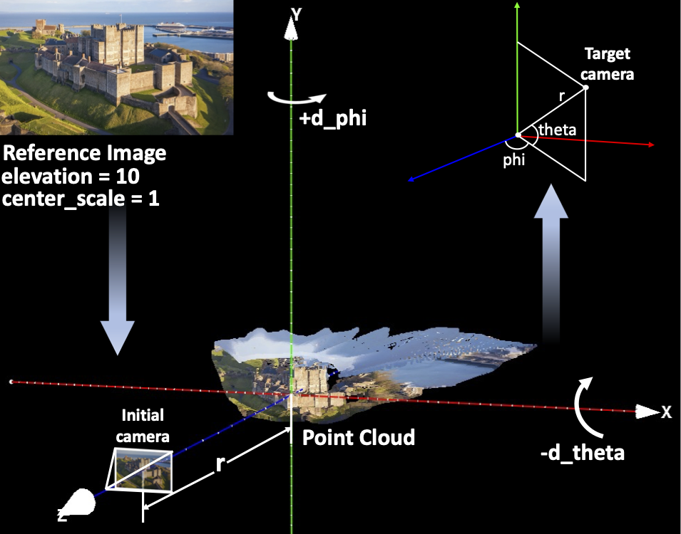

## Point cloud render configurations
| Configuration | default |   Explanation  | 
|:------------- |:----- | :------------- |
| `--mode` | 'single_view_txt' | Currently we support 'single_view_txt' and 'single_view_target' mode|
| `--traj_txt` | None | Required for 'single_view_txt' mode, a txt file that specify camera trajectory |
| `--elevation` | 5. | The elevation angle of the input image in degree. Estimate a rough value based on your visual judgment |
| `--center_scale` | 1. | Range: (0, 2]. Scale factor for the spherical radius (r). By default, r is set to the depth value of the center pixel (H//2, W//2) of the reference image |
| `--d_theta` | 10. | Range: [-40, 40]. Required for 'single_view_target' mode, specify target theta angle as (theta + d_theta) |
| `--d_phi` | 30. | Range: [-45, 45]. Required for 'single_view_target' mode, specify target phi angle as (phi + d_phi) |
| `--d_r` | -.2 | Range: [-0.5, 0.5]. Required for 'single_view_target' mode, specify target radius as (r + r*dr) |

The image above illustrates the definition of the world coordinate system. 
- Take a single reference image as an example, you first need to estimate an elevation angle `--elevation` that represents the angle at which the image was taken. A value greater than 0 indicates a top-down view, and it doesn't need to be precise.
- The origin of the world coordinate system is by default defined at the point cloud corresponding to the center pixel of the reference image. You can adjust the position of the origin by modifying `--center_scale`; a value less than 1 brings the origin closer to the reference camera.
- We represent the camera pose using spherical coordinates. The initial camera pose is located at (r, 0, 0). You can specify a target camera pose by setting `--mode` as 'single_view_target'. As shown in the figure above, a positive `--d_phi` moves the camera to the right, a positive `--d_theta` moves the camera down, and a negative `--d_r` moves the camera forward (closer to the origin). The program will interpolate a smooth trajectory between the initial pose and the target pose, then rendering the point cloud along that trajectory. Below shows some examples:
<table class="center">
    <tr style="font-weight: bolder;text-align:center;">
        <td> --center_scale </td>
        <td> --d_phi </td>
        <td> --d_theta </td>
        <td> --d_r </td>
        <td>Render results</td>
    </tr>
   <tr>
  <td>
    0.5
  </td>
  <td>
    45.
  </td>
  <td>
    0.
  </td>
  <td>
    0.
  </td>
  <td>
    
  </td>
  </tr>
   <tr>
  <td>
    1.
  </td>
  <td>
    45.
  </td>
  <td>
    0.
  </td>
  <td>
    0.
  </td>
  <td>
    
  </td>
  </tr>
     <tr>
  <td>
    1.
  </td>
  <td>
    0.
  </td>
  <td>
    -30.
  </td>
  <td>
    0.
  </td>
  <td>
     
  </td>
  </tr>
     <tr>
  <td>
    1.
  </td>
  <td>
    0.
  </td>
  <td>
    0.
  </td>
  <td>
   -0.5
  </td>
  <td>
    
  </td>
  </tr>
     <tr>
  <td>
    1.
  </td>
  <td>
    45.
  </td>
  <td>
    -30.
  </td>
  <td>
    -0.5
  </td>
  <td>
     
  </td>
  </tr>
</table>